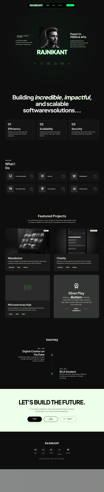

# 🚀 **RAJNIKANT - Full‑Stack Developer Portfolio**

🌟 *Showcasing a sleek, dynamic portfolio built with Node.js, Express, MongoDB, Cloudinary CDN, and Nodemailer.*



---

## ✨ **Features**

- **Dynamic Projects**: Real‑time projects fetched from MongoDB via a REST API (with loading spinners). 
- **Contact Form**: Instant email notifications via Nodemailer, stored in MongoDB. 
- **Silver Play Button Gallery**: Lightbox carousel with Cloudinary‑hosted images. 
- **Rate Limiting**: 5 requests per IP per hour on the contact endpoint. 
- **Input Sanitization**: XSS protection on all user inputs. 
- **Responsive Design**: Dark‑theme, mobile‑first layout.
- **Lazy Loading**: Images use `loading="lazy"` for fast performance.
- **CV Download**: Placeholder toast for upcoming PDF.

---

## 🛠️ **Tech Stack**

| Layer        | Technology                          |
| ------------ | ----------------------------------- |
| **Frontend** | HTML5, TailwindCSS (CDN), Vanilla JS |
| **Backend**  | Node.js, Express.js                 |
| **Database** | MongoDB Atlas (Mongoose ODM)        |
| **Images**   | Cloudinary CDN                      |
| **Email**    | Nodemailer (Gmail SMTP)             |
| **Security** | Helmet, CORS, express-rate-limit    |

---

## 📁 **Project Structure**

```
+------------------------+      +-------------------+
|  my_portfolio/         |------> Server (Node/Express)
+------------------------+      +-------------------+
|  models/               |      | - Project.js
|   ├─ Project.js        |      | - Message.js
|   ├─ Message.js        |      | - Silver.js
|   └─ Silver.js         |      +-------------------+
|  public/               |      |  public/ (static)
|   └─ index.html        |      |   - index.html
|  .env                  |      |   - assets etc.
|  .gitignore            |      +-------------------+
|  server.js             |
|  package.json          |
|  README.md             |
+------------------------+
```

---

## ⚙️ **Setup & Run Locally**

### Prerequisites
- **Node.js** v18+ 
- **MongoDB Atlas** account (connection URI in `.env`)
- **Gmail App Password** for Nodemailer

### Steps
1. **Clone** the repo:
```bash
git clone https://github.com/Ra533-c/my_portfolio.git
cd my_portfolio
```
2. **Install** dependencies:
```bash
npm install
```
3. **Configure** `.env` (example below):
```
PORT=5000
MONGO_URI=mongodb+srv://<user>:<pass>@cluster0.xxxxx.mongodb.net/?appName=Cluster0
EMAIL_USER=your-email@gmail.com
EMAIL_PASS=your-app-password
CLOUDINARY_CLOUD_NAME=your-cloud-name
CLOUDINARY_API_KEY=your-api-key
CLOUDINARY_API_SECRET=your-api-secret
SILVER_IMAGE1_URL=https://res.cloudinary.com/…
SILVER_IMAGE2_URL=https://res.cloudinary.com/…
SILVER_IMAGE3_URL=https://res.cloudinary.com/…
MY_PROFILE_PIC_URL=https://res.cloudinary.com/…
CV_URL=/cv.pdf
```
4. **Start** the server:
```bash
npm start
```
5. Open **http://localhost:5000** in your browser.

---

## 📡 **API Endpoints**

| Method | Endpoint           | Description                              |
|--------|--------------------|------------------------------------------|
| GET    | `/api/projects`    | Fetch all seeded projects                |
| GET    | `/api/silver`      | Retrieve Silver Play Button image URLs   |
| POST   | `/api/contact`     | Submit contact form (rate‑limited)       |
| POST   | `/api/upload-image`| Upload image to Cloudinary (admin auth) |

---

## 🚀 **Deployment Options**

### 1️⃣ Render (Free Tier – Recommended)
1. Push to GitHub
2. Create a new Web Service on Render
3. Set **Build Command**: `npm install`
4. Set **Start Command**: `npm start`
5. Add all `.env` vars in Render’s **Environment** tab

### 2️⃣ Railway
1. Push to GitHub
2. New Project → Deploy from GitHub
3. Populate environment variables in the dashboard

### 3️⃣ Vercel (Frontend) + Render (Backend)
- Deploy `public/` on Vercel
- Deploy backend on Render (as above)
- Update API URLs in `public/index.html`

---

## 🔐 **Gmail App Password Setup**
1. Open Google Account **Security** page.
2. Enable **2‑Step Verification**.
3. Go to **App Passwords** → Create a new password for **Mail**.
4. Use the generated 16‑char password for `EMAIL_PASS`.

---

## 📝 **Environment Variables**

| Variable                | Description                          |
|------------------------|--------------------------------------|
| `PORT`                 | Server port (default: 5000)          |
| `MONGO_URI`            | MongoDB Atlas connection string      |
| `EMAIL_USER`           | Gmail address for sending emails     |
| `EMAIL_PASS`           | Gmail App Password                   |
| `CLOUDINARY_CLOUD_NAME`| Cloudinary cloud name                |
| `CLOUDINARY_API_KEY`   | Cloudinary API key                   |
| `CLOUDINARY_API_SECRET`| Cloudinary API secret                |
| `SILVER_IMAGE1_URL`    | Silver Play Button image 1           |
| `SILVER_IMAGE2_URL`    | Silver Play Button image 2           |
| `SILVER_IMAGE3_URL`    | Silver Play Button image 3           |
| `MY_PROFILE_PIC_URL`   | Profile picture Cloudinary URL       |
| `CV_URL`               | CV PDF path (placeholder)            |

---

## 📜 **License**

ISC License © 2024 Rajnikant Goswami

---

**Built with ❤️ and Precision.**
